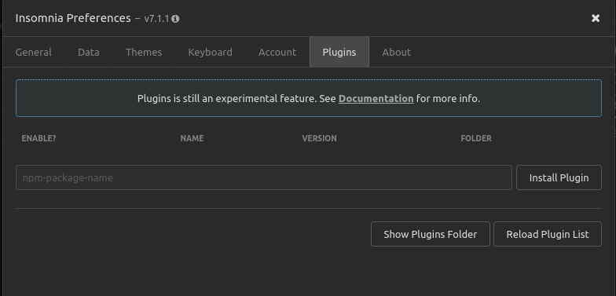
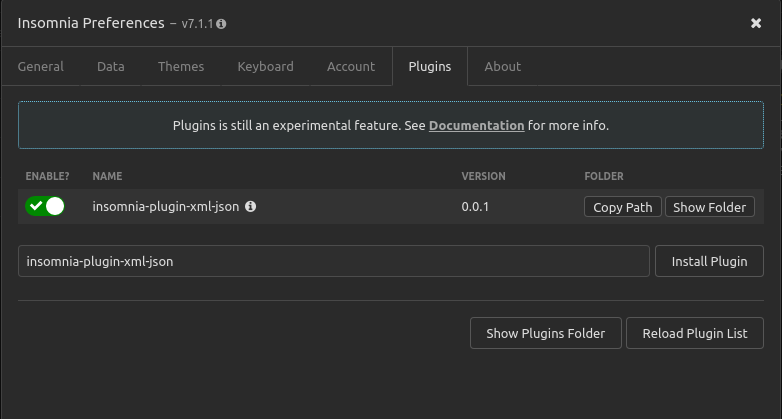
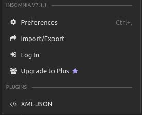
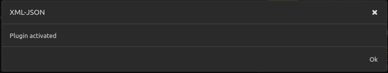

# Insomnia Plugin XML-JSON

This plugin was created with the incentive that I am working on a project in
that the api returns me an XML and inside it has a JSON and with it the (Insomnia which is incredible software) fails to format properly.

The format that the api returns to me is the following:

``` xml
<?xml version="1.0" encoding="utf-8"?>
<string>{"customers":[{"name":"Jhon Doe","email":"jhondoe@email.com"}]}</string>
```

The plugin only extracts the json from inside the `string` tag and returns it like this:

```json
{
  "customers":[
    {
      "name":"Jhon Doe",
      "email":"jhondoe@email.com"
    }
  ]
}
```

## Installing plugin

Access the Application / Preferences menu and then select the Plugins tab,
enter the plugin name `insomnia-plugin-xml-json` and click Install Plugin.



After installing the plugin click on enable




## Activating plugin

Click to open the workspace menu and then click on `XML-JSON`, a message
will tell you whether the plugin has been enabled or disabled.

 




